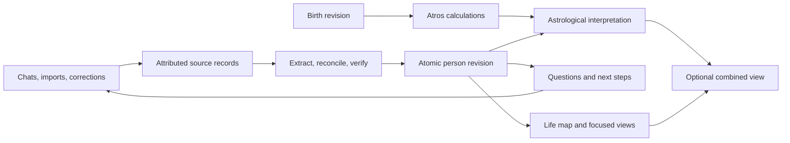

# Executing the approved life-understanding experience

Specification date: September 20, 2026. Status: P0–P2 implemented and verified on isolated staging; P3–P9 remain the delivery contract and production is unchanged.

The approved visual direction is fixed. Build the four [v2 mockups](../../design/astrologer-ui-mocks/2026-09-19/v2-life-map/README.md), including progressive disclosure, as views of one evolving person model. Text and diagrams must come from that model. The historical examples in the mockups are acceptance examples, never production seed content.

Read in this order:

1. [Current-state audit](CURRENT-STATE-AUDIT.md): verified code defects, live database observations, and which earlier design decisions need replacing.
2. [Execution specification](EXECUTION-SPEC.md): data ownership, agent responsibilities, consolidation, suggestions, astrology isolation, imports, APIs, and work packages.
3. [UI behavior contract](UI-BEHAVIOR-CONTRACT.md): every visible control, navigation, expanded states, and failure behavior.
4. [Acceptance plan](ACCEPTANCE-PLAN.md): release-blocking product, reasoning, concurrency, privacy, and runtime checks.
5. [Phased implementation plan](PHASED-IMPLEMENTATION-PLAN.md): dependency gates, feature-level E2E/visual/architecture proof, and agent handoff ledger.
6. [P0 execution receipt](P0-EXECUTION-RECEIPT.md): local proof harness, current read-only run state, and open verification boundaries.
7. [P1 progress receipt](P1-PROGRESS-RECEIPT.md): partial conversation fixes, verification results, and the remaining provider/dispatch gate.
8. [P2 execution receipt](P2-EXECUTION-RECEIPT.md): accepted person/revision authority, staging/browser proof, and the boundary before learned consolidation.

The primary architecture is:

Important decisions:

- A person's account and the companion's hypotheses remain distinguishable. The model stores meaning changes, conditions, exceptions, and unknowns, not only facts.
- Conversation handling and profile consolidation are separate durable processes. Every eligible user input triggers consolidation even when answering fails or no agent tool happens to record a fact.
- Questions and actions are stored, versioned consequences of goals, episodes, patterns, constraints, or knowledge gaps. They have dependencies and a lifecycle.
- Astrology off changes the reasoning context, available tools, generated suggestions, and projections. It is not only a CSS visibility switch.
- The Private control opens real access and data controls. It means account-scoped access; it does not imply end-to-end encryption or the absence of AI service processing.
- Keep the current provider adapter, Supabase, Vercel Workflow, and Atros calculation boundary. Correct their integration and add the missing domain model.

## Grounding retained from the approved product review

The approved design is grounded in reviewed personal accounts, while the
examples remain dated acceptance material rather than production seed data:

- A question about life and mortality at age 15 became an ambition to solve
  death; later questions about identity and living forever changed what that
  ambition meant, with the new meaning still partly unknown.
- The person describes recognizing AI as a direction in 2019 and later doing
  paid work that combines AI and longevity.
- During a 2018 preparation year, the person reports studying physics and
  coding outside the curriculum.
- Social contact is described as energizing, deep work as easier in chosen
  solitude, and prolonged isolation as draining ambition. The model must keep
  those conditions and exceptions together rather than collapsing them into a
  personality label.
- On September 17, 2026, the person described choosing content, products, and
  building in public, with slow progress and no first blog or product shipped
  yet. This is a historical snapshot that requires freshness checks.

These examples preserve the product principle that an event, its reported
impact, a proposed explanation, and an open question are separate records.
The reviewed sources below are outside this repository. They preserve design
provenance for the local review, not runtime dependencies or public fixtures:

- `/home/vulbsti/proj/atros/UTK_life_reasoning.md`, user account at lines 173–213.
- `/home/vulbsti/proj/atros/convo_dec_28_2025.md`, user account at lines 296–317.
- `/home/vulbsti/proj/atros/bhava_utk.md`, quoted account at line 191. The surrounding house interpretation is prior assistant analysis, not independent evidence.
- `/home/vulbsti/.codex/sessions/2026/09/17/rollout-2026-09-17T14-27-22-01a0ae95-b8d1-7512-b29f-cc3ce6565099.jsonl`, user message at line 20.
- `/home/vulbsti/.codex-opencode-go/sessions/2026/09/18/rollout-2026-09-18T16-38-45-01a0b434-5dd5-7261-8e97-61c238f6bcf7.jsonl`, the originally referenced continuation.

This package supersedes the earlier astrologer setup plan, particularly its
birth-gated person creation, profile-wide chat locking, fact-status-only
updates, and automatic confirmation of a hypothesis from two source IDs.

Review performed: source inspection at commit `27fc172156633cb15b550d1b36c69eb702fdcbba`, aggregate read-only queries against the connected Aidoraa database, current primary documentation, and 23 existing local unit tests. No production data or application code was changed by this specification task.
